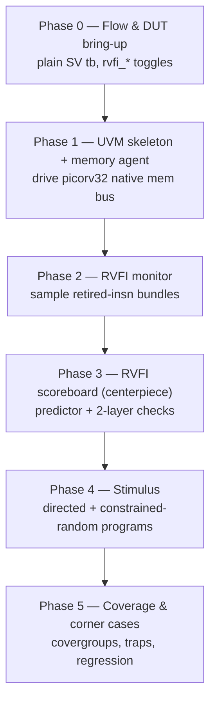
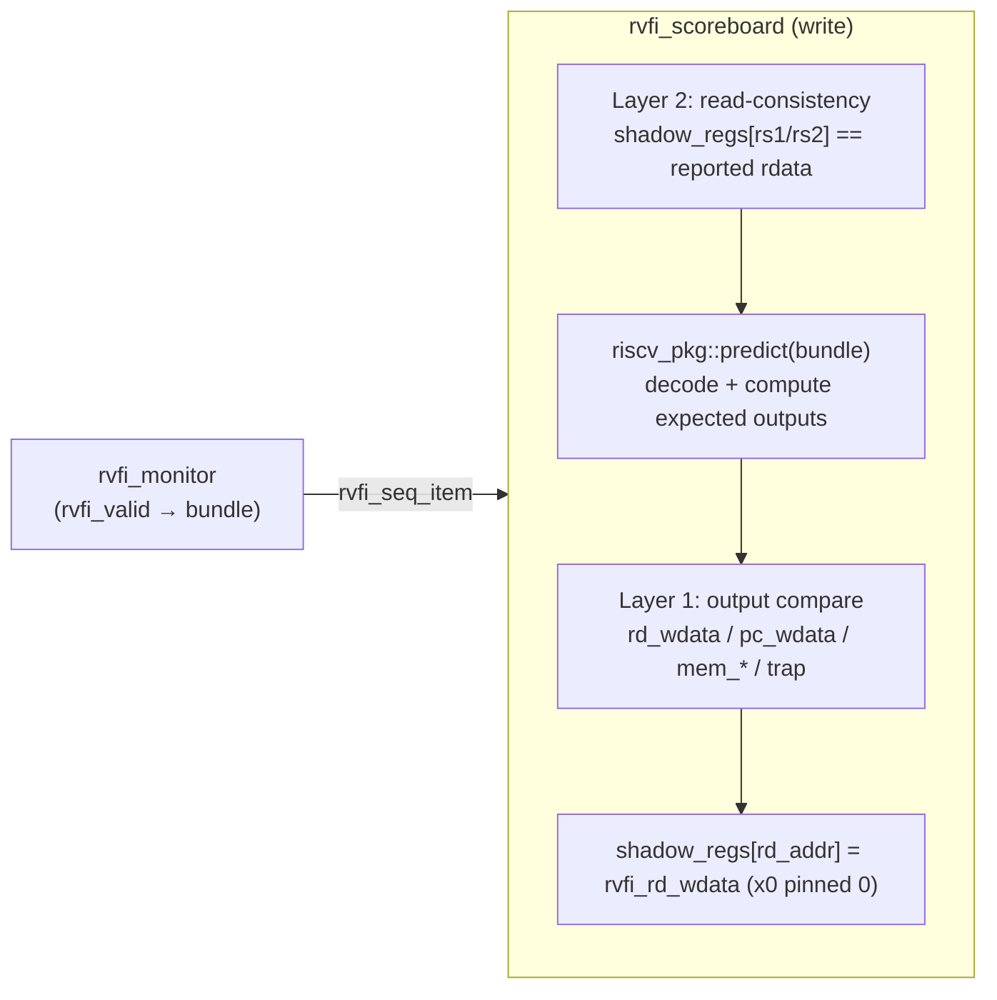

# PicoRV32 UVM Tutorial — Plan

## Context

This repo is a hands-on tutorial that teaches **UVM** (to SV-fluent readers) and
**RISC-V architecture** *together*, verifying the **PicoRV32** core by
self-checking its **RVFI** (RISC-V Formal Interface) output, runnable on a free
Questa flow.

This document tightens two things: the **phase breakdown** (each phase has a
single learning objective, concrete code deliverables, and an explicit
dependency on the prior phase) and the **RVFI scoreboard design** (a precise
two-layer, no-memory-model checker built on a reusable in-SV instruction
predictor).

Per-phase deliverable = **a markdown lesson + the incremental SystemVerilog/UVM
files that lesson builds**, each simulatable under free Questa
(ModelSim/Questa Intel FPGA Starter Edition).

## Phase breakdown (each phase builds on the previous)



- **Phase 0 — Flow & DUT bring-up.** Vendor `picorv32.v`, compile with
  `RISCV_FORMAL` so `rvfi_*` ports exist. Write a *plain* (non-UVM) testbench
  (`tb/smoke_tb.sv`) with a behavioral memory and a tiny hand-assembled program;
  confirm it fetches/executes and `rvfi_valid`/`rvfi_insn` toggle under Questa.
  *Goal:* nail the toolchain + the DUT's native memory contract and RVFI port
  before any UVM. *Deliverable:* lesson `docs/00-flow-and-dut.md`, `smoke_tb.sv`,
  `sim/run.do` (or Makefile), `sim/programs/hello.mem`.

- **Phase 1 — UVM skeleton + memory agent.** Introduce UVM and build the
  **memory-interface agent** (config, seq_item, driver, sequencer, monitor) that
  services picorv32 fetch/load/store on the `mem_valid/mem_ready` bus, backed by
  an associative-array memory model. A sequence preloads the program image. Wire
  `env`/`base_test`/`top`. *Goal:* core UVM component anatomy + the valid/ready
  driver pattern. *Deliverable:* lesson `docs/01-uvm-mem-agent.md`,
  `tb/agents/mem/*`, `tb/env/env.sv`, `tb/tests/base_test.sv`, `tb/top.sv`.

- **Phase 2 — RVFI monitor.** Passive monitor that, on `rvfi_valid`, packs the
  full retired-instruction bundle into `rvfi_seq_item` and broadcasts it on an
  analysis port. Lesson walks every RVFI field. *Goal:* RVFI semantics + passive
  monitor/analysis-port pattern. *Deliverable:* lesson `docs/02-rvfi-monitor.md`,
  `tb/interfaces/rvfi_if.sv`, `tb/agents/rvfi/{rvfi_seq_item,rvfi_monitor}.sv`.

- **Phase 3 — RVFI scoreboard (centerpiece).** Build the self-checking
  scoreboard described in the next section. Demonstrate it catching a deliberately
  injected mutation. *Goal:* UVM scoreboard pattern + RISC-V instruction
  semantics. *Deliverable:* lesson `docs/03-rvfi-scoreboard.md`,
  `tb/pkg/riscv_pkg.sv` (decode + `predict`), `tb/env/rvfi_scoreboard.sv`.

- **Phase 4 — Stimulus.** Sequence library: directed sequences per RV32I
  instruction class (LUI/AUIPC/JAL/JALR/BRANCH/LOAD/STORE/OP-IMM/OP), then a
  constrained-random instruction-stream generator. Optionally enable picorv32's
  `M`/`C` knobs and extend `predict`. *Goal:* sequence layering + ISA breadth.
  *Deliverable:* lesson `docs/04-stimulus.md`, `tb/seq/*`, new directed tests.

- **Phase 5 — Coverage & corner cases.** Functional covergroups (opcode,
  operand ranges, taken/not-taken branches, register read/write hazards), corner
  cases (x0 writes, misaligned access, traps, optional IRQ), and a regression
  `.do`/Makefile target. *Goal:* coverage closure + closing the verification loop.
  *Deliverable:* lesson `docs/05-coverage.md`, `tb/env/rvfi_coverage.sv`,
  `sim/regress.do`.

## RVFI scoreboard design (tightened)

**Strategy:** an **in-SV, instruction-local predictor** (riscv-formal style) —
no DPI/Spike, no memory model in the scoreboard. Each retired bundle is checked
*locally* using the inputs RVFI already reports, plus a lightweight shadow
regfile for cross-instruction read-consistency.



**`riscv_pkg::predict(bundle)` — pure function, unit-testable.** Inputs taken
from the bundle as *trusted reported values*: `rvfi_insn`, `rvfi_pc_rdata`,
`rvfi_rs1_rdata`, `rvfi_rs2_rdata`, and (loads only) `rvfi_mem_rdata`. It decodes
the instruction (opcode/funct3/funct7, imm I/S/B/U/J) and returns an expected
struct: `rd_addr`, `rd_wdata`, `pc_wdata`, `mem_addr`, `mem_rmask`, `mem_wmask`,
`mem_wdata`, `trap`. Covers RV32I in Phase 3; M/C added in Phase 4–5.

**Layer 1 — instruction-local output check (stateless given the bundle):**
compare predicted vs RVFI-reported `rd_addr`, `rd_wdata`, `pc_wdata`, and the
memory fields. Key rules to encode explicitly (these are the lesson's teaching
points):
- `rd == x0` ⇒ expected `rd_wdata == 0`.
- `pc_wdata` = `pc+4`, branch target (taken vs not-taken from rs1/rs2 compare),
  `JAL` target, or `JALR` `(rs1+imm) & ~1`.
- Loads: `mem_addr = rs1+imm`, `mem_rmask` from funct3/alignment; `rd_wdata` =
  sign/zero-extended slice of reported `rvfi_mem_rdata` per funct3.
- Stores: `mem_addr`, `mem_wmask`, `mem_wdata` from funct3 + rs2.
- Illegal/misaligned ⇒ expect `rvfi_trap`; otherwise expect no trap.

**Layer 2 — register read-consistency (stateful, no memory model):** maintain
`logic [31:0] shadow_regs[0:31]` (init 0, x0 pinned). *Before* Layer 1, assert
`rvfi_rs1_rdata == shadow_regs[rvfi_rs1_addr]` (and rs2) when the addr ≠ 0 —
catches the core reading stale/wrong registers. *After* Layer 1 passes, update
`shadow_regs[rvfi_rd_addr] = rvfi_rd_wdata`. Use `rvfi_order` to assert in-order,
single-channel retirement; skip checks on `rvfi_halt`.

**Scope boundary (state in the lesson):** because loads consume the
core-reported `rvfi_mem_rdata`, the scoreboard does **not** verify memory
*coherency over time* — that would need a separate memory scoreboard, called out
as an optional advanced extension, not built here.

## Repo layout to create (representative)

```
rtl/picorv32.v                     # vendored DUT (YosysHQ/picorv32), RISCV_FORMAL
tb/top.sv
tb/interfaces/{picorv32_mem_if,rvfi_if}.sv
tb/pkg/{riscv_pkg,picorv32_uvm_pkg}.sv
tb/agents/mem/{cfg,seq_item,driver,sequencer,monitor,agent}.sv
tb/agents/rvfi/{rvfi_seq_item,rvfi_monitor}.sv
tb/env/{env,rvfi_scoreboard,rvfi_coverage}.sv
tb/tests/base_test.sv ; tb/seq/*
sim/{run.do,regress.do}            # Questa flow (vlog/vopt/vsim)
sim/programs/*.mem
docs/00..05-*.md                   # per-phase lessons
```

## Reuse / don't reinvent

- Vendor `picorv32.v` from YosysHQ/picorv32 as-is; take the `rvfi_*` port list and
  field widths **verbatim** from its `RISCV_FORMAL` block — that is the
  `rvfi_seq_item` contract.
- Mirror riscv-formal's field set so the scoreboard semantics match an
  established spec rather than an invented one.
- Reuse picorv32's native memory-interface protocol (`mem_valid/mem_ready/
  mem_wstrb/...`) directly for the mem agent's driver.

## Verification

- **Per phase:** run that phase's `sim/run.do` under free Questa
  (`vlog -sv ...; vopt; vsim -c -do run.do`); expect `UVM_ERROR : 0` and a
  visible RVFI trace.
- **Scoreboard proof (Phase 3):** inject a mutation (e.g. force one
  `rvfi_rd_wdata` wrong, or skip the x0 rule) and confirm the scoreboard raises a
  `UVM_ERROR` pinpointing the field + `rvfi_order`. Revert and confirm clean.
- **Regression (Phase 5):** `sim/regress.do` runs all directed + a seeded random
  test; gate on zero UVM errors and a coverage summary.
- Each lesson ends with the exact command to reproduce its result.
